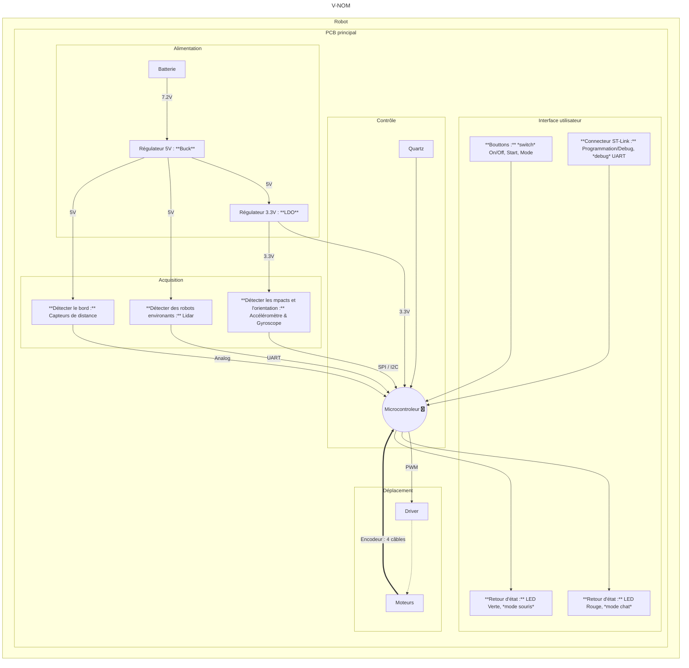

# 2425-ESE-Projet-V-NOM

Ce projet consiste à créer un robot capable de jouer à chat avec d'autres robots du même type. Ils joueront sur une table sans bordures et devront donc être capable de détecter les bords de celle-ci.
Les élèves sont chargés de réaliser les schémas électroniques, le routage et la configuration des différents composants choisis pour réaliser ce projet. 
Celui-ci est piloté par un microcontrôleur de type STM32.

Groupe: Mohamed Benabdelhadi, Nouhaila Faris, Oliver Belliard, Valerian Priou.


## Strategie
La stratégie de déplacement retenue a été de détecter les bords de la surface de l'arène grâce à des capteurs de distance à l'avant et à l'arrière du robot.  
**En mode souris :** le robot cherche à garder la plus grande distance possible du robot adverse ("chat"), tout en évitant les bords.  
**En mode chat :** le robot cherche à entrer en contact avec le robot adverse ("souris") par collision.  
La détection de la position du robot adverse se fait grâce au capteur Lidar qui permet de déterminer une trajectoire en temps réel. La détection de la collision est faite grâce à l'accéléromètre.


## BOM (Bill Of Materials)
### Liste des composants
- Microcontrôleur : STM32G431CBU6 [(ST-Microelectronics)](https://www.st.com/en/microcontrollers-microprocessors/stm32g431cb.html)  
- Quartz 16 MHz [(Farnell : 2853935)](https://fr.farnell.com/multicomp/mcsjk-7u-16-00-10-30-80-b-30/quartz-16mhz-10pf-3-2mm-x-2-5mm/dp/2853935?srsltid=AfmBOopnM4CmIZbCnYPaPceE-P2LMk88lLX2_RwnxhyCD5bpNZaeiR3n)  
- Connecteur SWD/STLink [(Farnell : 3226055)](https://fr.farnell.com/harwin/m50-3600742/conn-btb-header-14-voies-2-rangs/dp/3226055?srsltid=AfmBOor9wrCqsNTtS0W1yuL9x_f5FiK8xT4XoT9aEqTOFeltcxXGvdPQ)  
- Driver moteur : ZXBM5210-SP-13 [(Farnell : 3946343)](https://ch.farnell.com/fr-CH/diodes-inc/zxbm5210-sp-13/motortreiber-40-bis-105-c/dp/3946343?CMP=KNC-GFR-GEN-KWL-AOV-Offer-WF3781360&gad_source=1&gclid=CjwKCAjw3P-2BhAEEiwA3yPhwGV5aPJYUKD97SgLbRqu1EroNwTg01IXEdbgGeSrMMuvoeATZ1GqERoCIYEQAvD_BwE)  
- Moteurs : DfRobot FIT0520 ou FIT0521 [(Farnell : 4308214)](https://fr.farnell.com/dfrobot/fit0521/motor-ducteur-cc-34-1-210rpm-6v/dp/4308214)  
- Accéléromètre : ADXL343BCCZ-RL [(Farnell : 4030100)](https://fr.farnell.com/analog-devices/adxl343bccz-rl/acc-l-rom-tre-mems-num-axes-x/dp/4030100?srsltid=AfmBOoro-h5zpF1LSuoTRTKOyh85rKB_GdqCSWf61a05DiefwqK19_Ev)  
- Régulateur 5V : MP1475S [(Farnell : 3357926)](https://fr.farnell.com/monolithic-power-systems-mps/mp1475sgj-p/conv-dc-dc-sync-buck-500khz-125/dp/3357926)  
- Régulateur 3.3V : BU33SD5WG-TR [(Farnell : 3011248)](https://fr.farnell.com/rohm/bu33sd5wg-tr/ldo-fixe-3-3v-0-5a-40-a-105-c/dp/3011248)  
- Batterie NIMH 7.2V 1.3Ah [(RS : 777-0377)](https://fr.rs-online.com/web/p/blocs-batteries-rechargeables/7770377?srsltid=AfmBOoqrzm-2xAbhXLv9pRw4Oh5hJvgaiMIRUeVsAtR-6kuSAeCwSjIW)  
- Capteur bordure : GP2Y0A41SK0F [(RS : 666-6568)](https://fr.rs-online.com/web/p/capteurs-optiques-reflechissants/6666568?gb=s)   
- Lidar : [YDLIDAR X4](https://www.ydlidar.com/dowfile.html?cid=5&type=1)
- Connecteurs JST 2.54mm
- LED + R/C en 0603 :
    - LED Rouge : [(Farnell : 150060RS55040)](https://fr.farnell.com/wurth-elektronik/150060rs55040/led-rouge-90mcd-624nm-cms/dp/2900762?srsltid=AfmBOorNugn7Hvu9bw1OmH61YvC2Vub_GdCKCcCiIE3ujNj7Wx1MRa4I)
    - LED Verte : [(Farnell : 150060GS55040)](https://fr.farnell.com/wurth-elektronik/150060gs55040/led-verte-430mcd-525nm-cms/dp/2900760)
- Cable avec Connecteur du capteur de bordure : A03SR03SR30K152A [(Mouser : 306-A03SR03SR30K152A)](https://www.mouser.fr/ProductDetail/JST-Commercial/A03SR03SR30K152A?qs=QpmGXVUTftGJe7b%2B%2FlYZEQ%3D%3D)
- Port pour câble du capteur de bordure : BM03B-SRSS-TB(LF)(SN) [(Farnell : 1679128)](https://fr.farnell.com/jst-japan-solderless-terminals/bm03b-srss-tb-lf-sn/embase-entree-sur-le-dessus-3/dp/1679128?&CMP=KNC-GFR-GEN-SKU-MDC-Connectors-Cables-Testing-with-Restricted-MPNs-14-March&mckv=s_dc%7Cpcrid%7C648720547172%7Ckword%7Cbm03b%20srss%20tblfsn%7Cmatch%7Cp%7Cplid%7C%7Cslid%7C%7Cproduct%7C%7Cpgrid%7C129493161308%7Cptaid%7Ckwd-1185703700119%7C&gad_source=1&gclid=Cj0KCQjw9Km3BhDjARIsAGUb4nwrscZTVEgmP52M6HoGuYSXzhf93gxqATGiTRUDuMloynbn5Pj27rIaAikjEALw_wcB) *This product displays (LF)(SN) on the label to indicate RoHS compliance.* (JST_EH_S3B-EH_1x03_P2.50mm_Horizontal)
- Boutons poussoirs : [Wurth 430182070816] → empreinte KiCAD : SW Push 1P1T NO 6x6mm H9.5mm
- Interrupteur ON/OFF : [Wurth 472121020311] → empreinte à faire  
  
**Fournisseurs autorisés :** RS, Farnell, Mouser.

### Sources d'empreintes
Pour les empreintes officielles (serveur utilisé par Farnell, Mouser...) : https://componentsearchengine.com/ 
> La création de compte est gratuite. <u> **/!\\**</u> La recherche et le téléchargement des empreintes composants doit se faire directement depuis le site et non pas depuis les sites de fournisseurs de composants pour éviter les bugs !


## Diagramme d'architecture



## Schémas utiles


## Exemples de projets avec le YDLIDAR X4
- [**stm32-ydlidar-x4**](https://github.com/radii-dev/stm32-ydlidar-x4)
> /!\\ Attention : Pour développer avec la carte P-PNUCLEO-IHM3 (avec une NUCLEO-G431RB) il faut retirer le module shield X-NUCLEO-IHM16M1-1 !


## Astuces et solution à des erreurs courrantes
### Erreur de STM32CubeIDE recontré en Ubuntu 24 : libncurses5 missing
> Could not determine GDB version using command: /opt/st/stm32cubeide_1.2.0/plugins/com.st.stm32cube.ide.mcu.externaltools.gnu-tools-for-stm32.7-2018-q2-update.linux64_1.0.0.201904181610/tools/bin/arm-none-eabi-gdb --version

Source: [Reddit post: libncurses5-dev?](https://www.reddit.com/r/Ubuntu/comments/1cm97bg/libncurses5dev/). Issue: libncurses5 was removed in 24.04.   

**Solution:**  
```bash
wget http://archive.ubuntu.com/ubuntu/pool/universe/n/ncurses/libtinfo5_6.4-2_amd64.deb && sudo dpkg -i libtinfo5_6.4-2_amd64.deb && rm -f libtinfo5_6.4-2_amd64.deb

wget http://archive.ubuntu.com/ubuntu/pool/universe/n/ncurses/libncurses5_6.4-2_amd64.deb && sudo dpkg -i libncurses5_6.4-2_amd64.deb && rm -f libncurses5_6.4-2_amd64.deb

sudo apt install lib32ncurses5-dev libncurses5 libncurses5-dev -y
```

### Mettre à jour une branche à partir de la branche principale (```main```)
```bash
git rebase master
```
### Se lancer avec le **protocole SPI** en STM32
C'est utile de regarder [le site officiel](https://wiki.st.com/stm32mcu/wiki/Getting_started_with_SPI#What_is_Serial_Peripheral_Interface_-28SPI-29--).
Quand STM32CubeIDE crash au démarage avec ue erreur `"Java" is not responding` il faut effacer le dossier nomé `.metadata` dans le répertoire workspace qui pose problème.

### Annuler un merge sur GitHub

Il faut resset la tête sur le commit juste avant la tête actuelle. Solution sur [Stack Overflow](https://stackoverflow.com/questions/42860234/how-to-undo-a-merge-in-github)
```bash
git checkout master
git reset --hard <commit_before_merge>
git push -f
```

Exemple :
```bash
git checkout master
git reset --hard master
git push -f
```

### Forcer un commit
Solution sur [Stack Overflow](https://stackoverflow.com/questions/448919/how-can-i-remove-a-commit-on-github)
On se remet sur la branche :
```bash
git rebase -i HEAD~2
```
Puis on force le push de la branche qu'on souhaite restaurer :
```bash
git push origin <branch_name> --force
```
## Test Hardware :
Composants fonctionnels:
1. UART1
2. Quartz
3. Switch*2
4. Connecteur lidar
5. Driver Moteur

Composants non fonctionnels:
1. Leds (inversés)
